# KERONIAO

KERONIAO is an app that is meant for **users to view/list items for sale**. The aim of this app is to allow anyone to post and/or view listings and allow the **users to chat with one another** to arrange a deal.

## Link to my Public Board: https://github.com/users/mervynleong/projects/3

### Storyboarding:

I want to create an app "**For the General public**" to "**View or create item listings to sell on the app**"

The inspiration of this app is from "**Taobao**" ecommerce website and phone app.
This app focuses on the **1-1 aspect of multiple listings** instead of multiple items in a listing.

### What the App does:

## Registration and Login

Firstly: The user will be directed to the **Login Page** at the start depicted in the picture below.
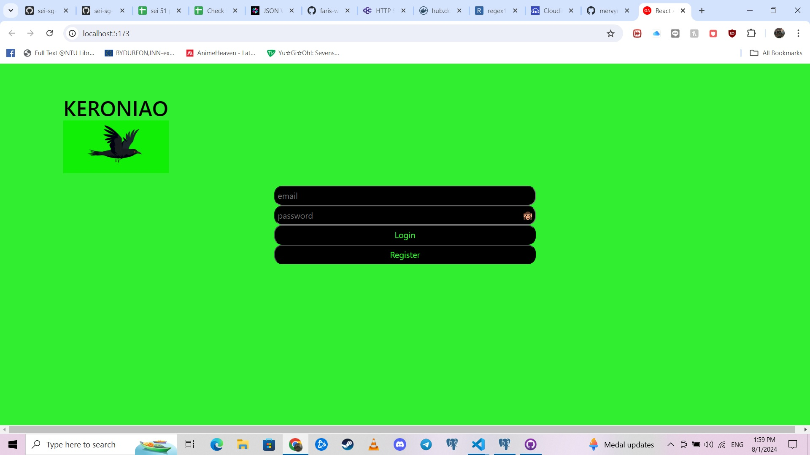

If the user has an account, he or she can proceed to key in the necessary details. In addition, the user can click on the **monkey** emoji to reveal the password as a friendly user interface as shown below:

If the user does not have an account, the user will need to **register** in the next page as shown below.

There will be errors when the user **does not meet the criteria** in registration when the register button is clicked:
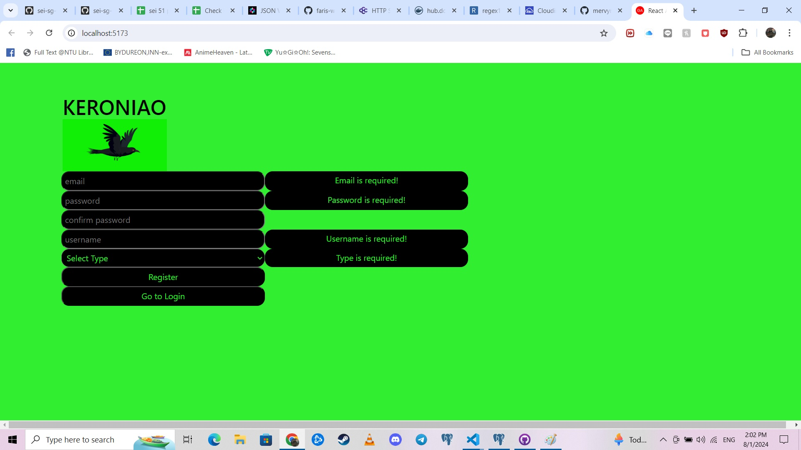

In addition as a precautionary measure to ensure the user knows his/her password that he/she type, the registration button will turn "**OFF**" as depicted in the picture below:
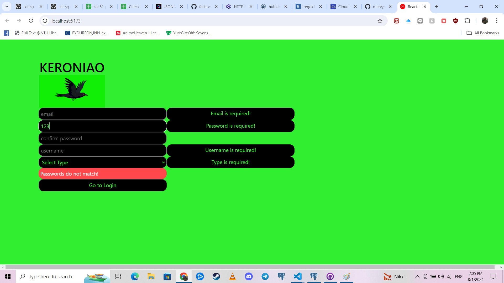

Once the registration is **successful**, the user will be redirected to the login page.

## Upon Login

The user will be directed to the landing page as shown below:
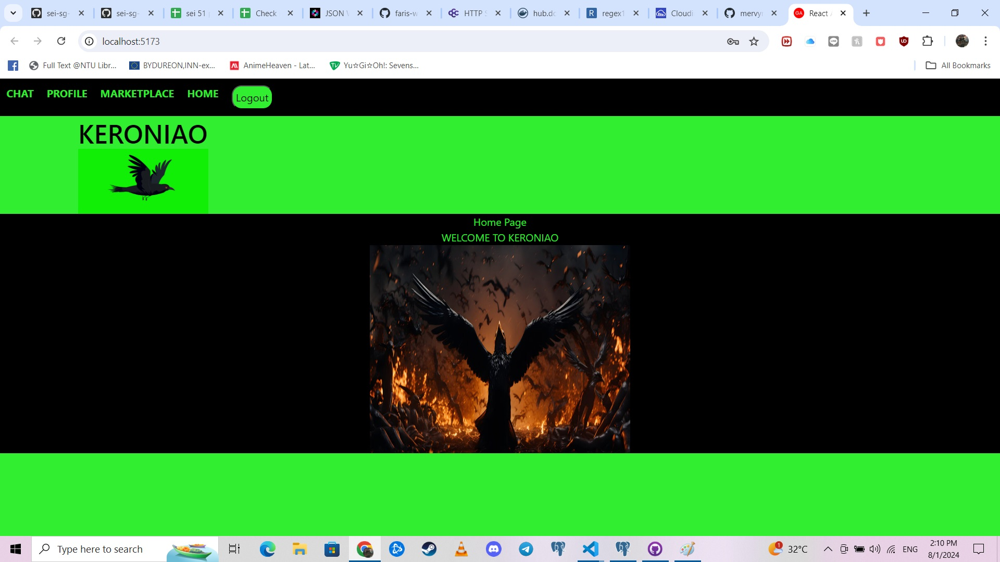

## LOGOUT

There will be a navigation bar at the top of the screen.
Clicking on the **LOGOUT** button will lead the user to the login screen and will perpetually **""logout""** the user from accessing the rest of the features.

## HOME

Clicking on the **HOME** button will lead the user to the current landing page as previously shown.

## MARKETPLACE

Clicking on the **MARKEtPLACE** button will lead the user to view the listings available.

If the user is logged in as a **SELLER** role (chosen when registering for an account), the page will be as shown:
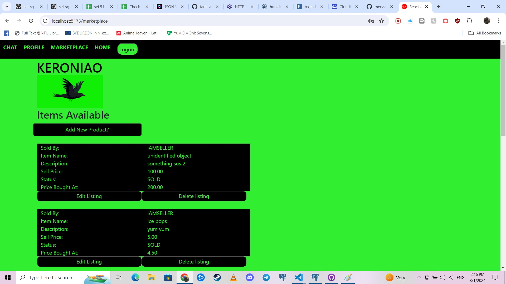

The seller will be able to add, edit and delete listings (if the listing belonged to him/her). Clicking on the **edit listing** button will prompt out a smaller frame for the user to key in the relevant inputs. If the inputs are valid and upon clicking **update info** button, the listing will be edited accordingly. Otherwise there will be an error as shown:
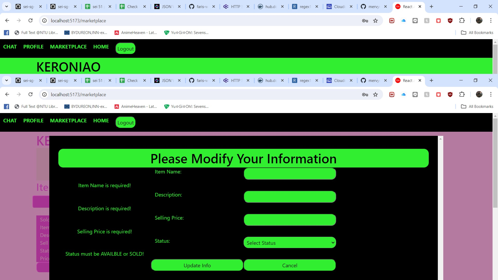

If the user is logged in as a **BUYER** role (chosen when registering for an account), the page will be as shown:

The buyer will be able to **chat** with the relevant seller to purchase by clicking on the **Chat with seller to purchase** button.
The buyer will be required to key in a text input to start the conversation to proceed with the next step for purchase. If no text inputs are detected, the error will be depicted as shown:
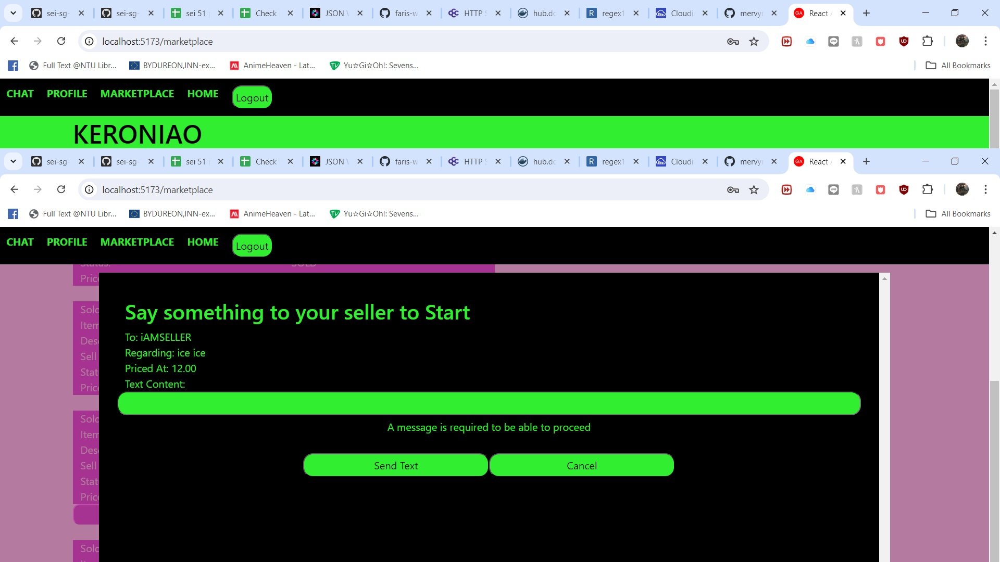

## CHAT

Clicking on the **CHAT** button will lead the user to view the chats available.

The buyer/seller will be able to view the chat by clicking on the **Chat with Person regarding this item** button.
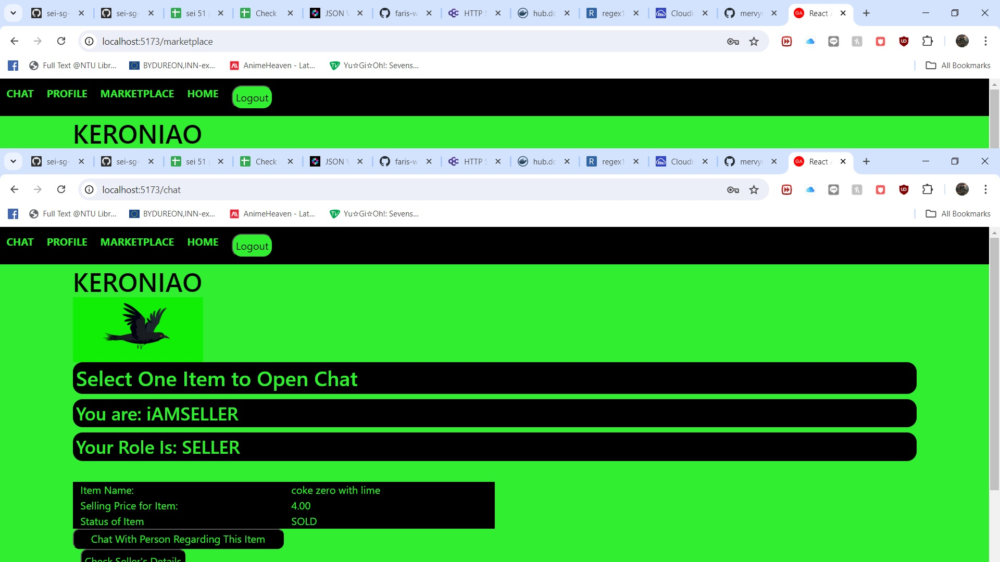

The user can check for the seller's details such as **interests and also the preferred location** as depicted below:
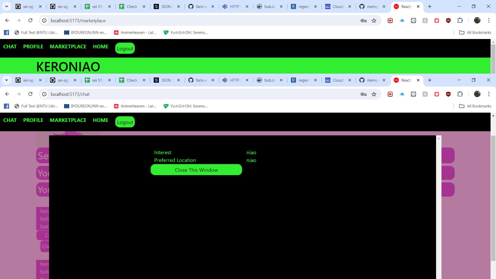

The picture below depicts the seller's Point-of-View:
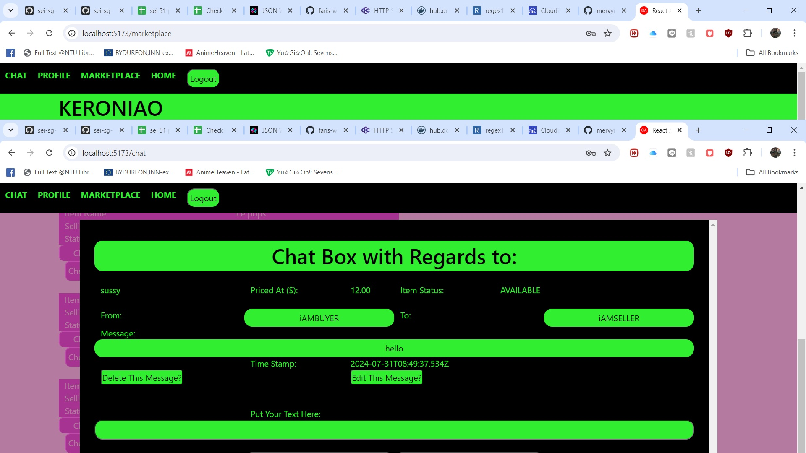

The seller can only **reply, edit or delete messages**. If an empty text is sent, an error will be thrown out like previously mentioned in **MARKETPLACE** (by the buyer).

The picture below depicts the buyer's Point-of-View:
The buyer can only **buy item, edit/ delete/ reply to messages**. If the buyer inputs an empty input for the price. An error will be thrown as shown:
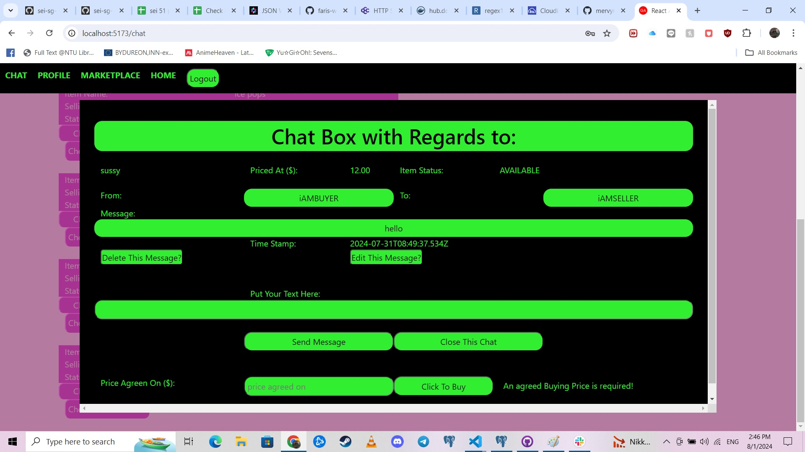

**NOTE**: Upon clicking buy, the status of the item is update from **AVAILABLE** to **SOLD** in the **MARKETPLACE**. Any item that is sold will not allow other buyer to initiate a new chat with the seller. The old chat will still be available to discuss anything.

## PROFILE

Clicking on the **PROFILE** button will lead the user to be able to view/edit the user's details as shown in the two images below:

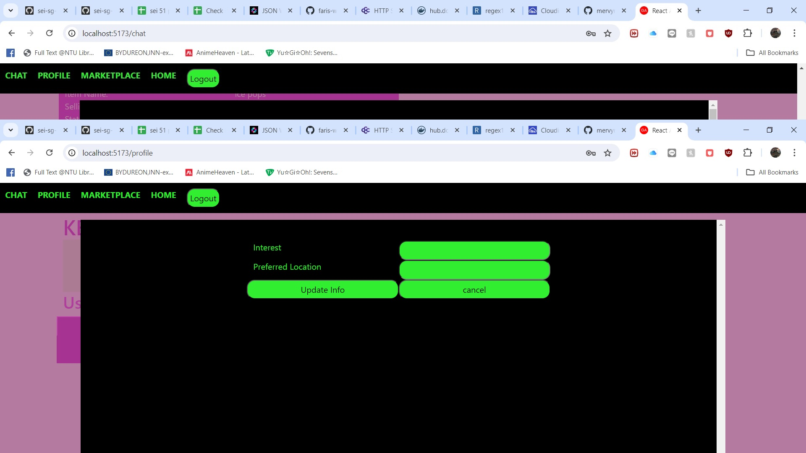

### Technologies used

- PostGresSQL
- Express
- React
- Node
- VITE
- POSTMAN (for testing backend APIs)
- Javascript
- Cascading Style Sheets
- Hypertext Markup Language

### TO NOTE

There is an admin role to **delete listings, messages and also users**. However these features are **not available on the frontend** and will only be available to the user if he/she has the access to the backend's API.

In addition. Due to the **constraints** PostGresSQL has, cascade deletion would be detrimental. However one can delete in the following order to delete a user:

- Delete all relevant chat's created by the user.
- Delete all relevant listings created by the user.
- Delete the user.

### Planned future installments

- Addition of cloudinary to allow upload of file images.
- Addition of web-sockets to allow user to see the chat being updated live.

### References

**For sound:**
https://mixkit.co/free-sound-effects/game/

**For background images:**
https://static.vecteezy.com/system/resources/thumbnails/028/896/726/original/2d-cartoon-crow-bird-flying-frame-by-frame-animation-4k-screen-green-4k-free-video.jpg

https://t3.ftcdn.net/jpg/06/20/38/62/360_F_620386202_roR3cn79s3JURKf0HbREwySWHY1bg3Hm.jpg

**For site logo:**
https://icon-icons.com/icon/twitter-bird-social-network/17885

### SPECIAL THANKS TO:

GA's Desmond and Gabrielle for guiding me through this project and also debugging.
